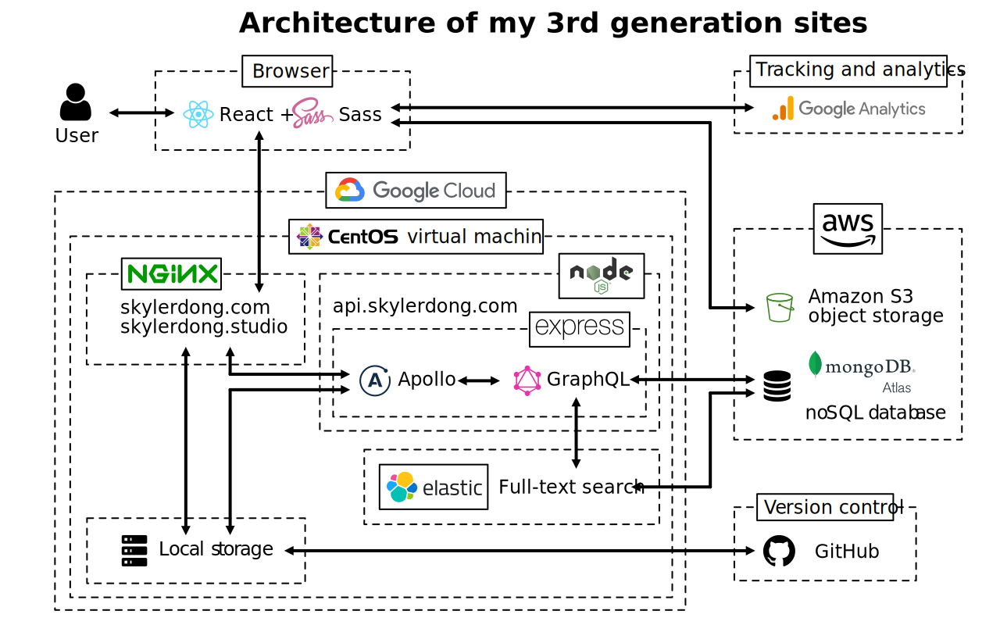

# Working Repository for SkylerDong.com

Website: [https://skylerdong.com](https://skylerdong.com)

Working repo: [https://github.com/dongskyler/gen3.skylerdong.com](https://github.com/dongskyler/gen3.skylerdong.com)

***

## Description

This repository is the active working repository for my personal website at [https://skylerdong.com](https://skylerdong.com).

This is the 3rd generation of my website. I&apos;m currently building it with [TypeScript](https://www.typescriptlang.org) [React](https://reactjs.org) and [Sass](https://sass-lang.com).

### Previous generations of my websites

- [2nd generation of my website](https://gen2.skylerdong.com/) and its [repository](https://github.com/dongskyler/gen2.skylerdong.com), which was established in early 2020 and built with [Bootstrap 4](https://getbootstrap.com), [JQuery](https://jquery.com), [Sass](https://sass-lang.com), vanilla [PHP](https://www.php.net) and [MySQL](https://www.mysql.com).
- [1st generation of my website](https://gen1.skylerdong.com/), which was established in 2015 and built with a Google Site template.

**_Note that all websites mentioned in this README might be down, as I&apos;m currently configuring A records and the server itself._**

***

## Architecture

***

## Copyright Notice

The code of the website is under MIT license.

However, my photographs are not. It is always appreciated when you refer back to my website. However, all images appearing on my root domain and all subdomains are not to be downloaded or reproduced in any way without permission. If you intend to use my images by any means or purchase prints, you are welcome to contact me at [dongskyler@gmail.com](mailto:dongskyler@gmail.com). Thank you.

***

## Server Specs

- Server provider: Google Cloud virtual machine
- Static IP: 35.223.28.142
- CPU: 1 core
- RAM: 2 GB
- Operating system: CentOS 8
- Web server: Nginx

***

## Writing Style

All writings on my website follow [AP Style](https://owl.purdue.edu/owl/subject_specific_writing/journalism_and_journalistic_writing/ap_style.html). :sunglasses:
